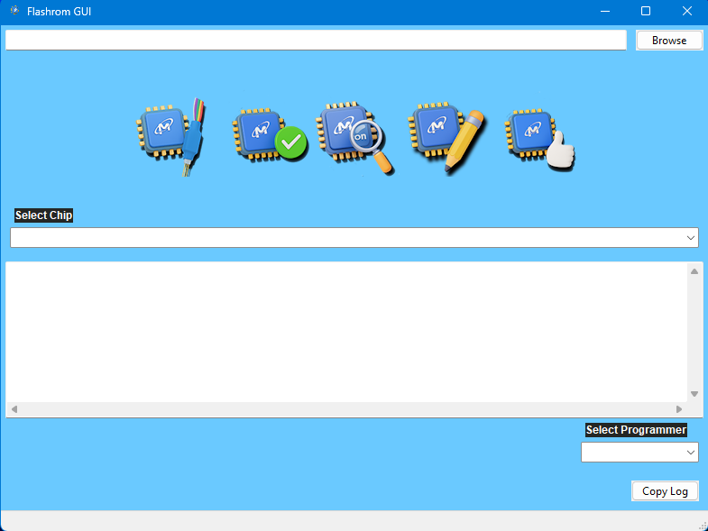
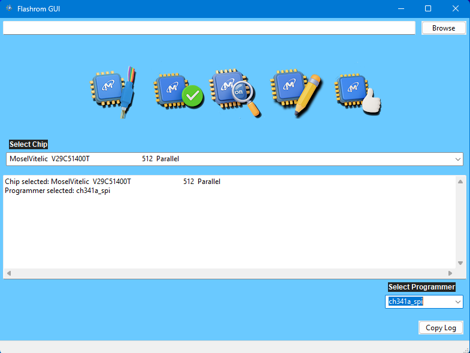

# ⚡ **FlashromGUI**  
*A modern, user‑friendly graphical interface for Flashrom — designed for clarity, safety, and speed.*

<p align="center">
  
</p>
<p align="center">
  <a href="https://www.dropbox.com/scl/fi/m2r4vzg6717hkrbt6wtqe/Flashrom_GUI_Installer.exe?rlkey=jplyixsxuvx2hq5miyxyxlwm5&st=outrez7l&dl=1">
    
  </a>
</p>
<p align="center">
  <strong>Cross‑platform</strong> • <strong>Beginner‑friendly</strong> • <strong>Power‑user ready</strong>
</p>

---

## 🎯 **Overview**

FlashromGUI brings the power of the Flashrom command‑line utility into a clean, intuitive graphical interface.  
Whether you're a hardware enthusiast, firmware engineer, or technician, FlashromGUI streamlines reading, writing, verifying, and backing up firmware chips — without sacrificing control or transparency.

---

## ✨ **Features**

### 🖥️ **Modern, Responsive Interface**
- Clean layout built with wxPython  
- Dynamic status updates and progress indicators  
- Clear separation of critical actions (read/write/erase)

### 🔌 **Hardware‑Aware**
- Automatic chip detection  
- Real‑time logging panel  
- Supports common programmers and SPI devices

### 🛡️ **Safety‑Focused**
- Pre‑flash validation  
- Backup prompts  
- Error‑resistant workflow with detailed warnings

### 📦 **Portable Distribution**
- Fully packaged PyInstaller EXE  
- No Python installation required

---

## 📸 **Screenshots**


<p align="center">
  
  <br>
  <em>Main interface</em>
</p>

<p align="center">
  
  <br>
  <em>Live logging and chip detection</em>
</p>

---

## 🚀 **Installation**

### **Option 1 — FlashromGUI Installer (Recommended)**
- Includes VC++ runtime  
- Creates Start Menu and Desktop shortcuts  
- Clean uninstall support  

Download the latest installer from the "Download Installer" button above.

### **Option 2 — Portable EXE**
- No installation required  
- Just extract and run `FlashromGUI.exe`

---

## 🧩 **Usage**

### **Basic Workflow**
1. Launch FlashromGUI  
2. Select your programmer    
3. Choose an action:
   - **Detect** → Chip Detection
   - **Probe** → Read/Write/Verify/Detect with a chip probe for chips that are still connected to the board (in-circuit) 
   - **Read** → Save a backup  
   - **Write** → Flash new firmware  
   - **Verify** → Confirm integrity
4. Review logs in real time


---

## 🧪 **Development Setup**

```bash
git clone https://github.com/KantBStoppd/flashromgui.git
cd FlashromGUI

# Create environment
python -m venv venv
source venv/bin/activate  # Windows: venv\Scripts\activate

# Install dependencies
pip install -r requirements.txt

# Run the app
python flashrom_gui.py
```

## 🐞 **Troubleshooting**

### Flashrom not detected  
Ensure Flashrom is included in your PATH or specify a custom path in Settings.

### Programmer not recognized  
Some programmers require drivers or elevated permissions.

### Write operation fails  
Check:
- Chip is unlocked  
- Correct programmer selected  
- Firmware image matches chip size  

---


## 🙏 **Acknowledgements**

FlashromGUI is built on top of the incredible work of the **Flashrom** CLI project and the open‑source community.

---

## 📜 **License**

MIT License — see `LICENSE` for details.
